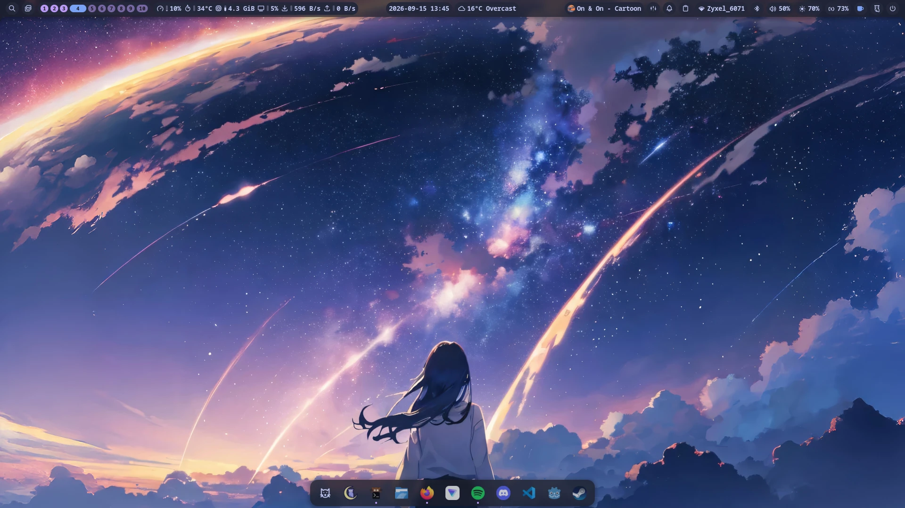
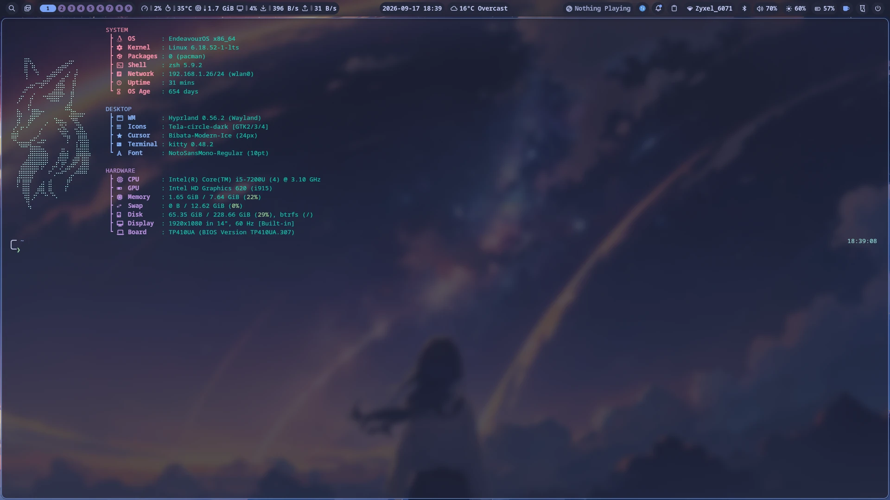
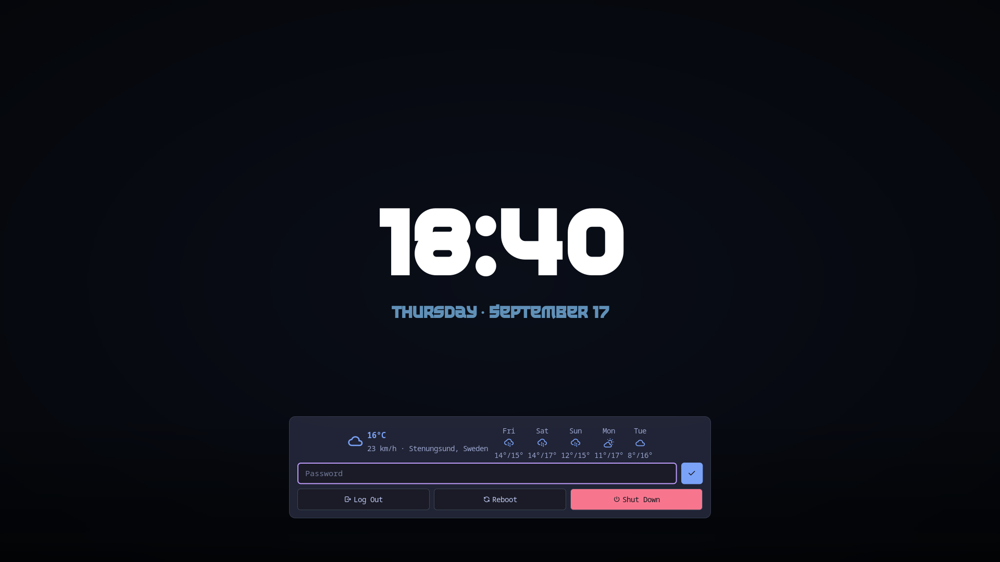

# Hyprland + Noctalia Dotfiles

Personal configuration for Hyprland (Lua config) + Noctalia desktop,
tested on Arch-based distributions (CachyOS, EndeavourOS).



## Features

- Hyprland Lua config (0.55+) with split module files
- Noctalia shell: bar, dock, lock screen, idle (dim → lock → lock-and-suspend)
- Host-aware monitor presets — same repo, multiple machines
- Themed kitty, fastfetch, VSCode (workspace Lua LSP stubs)
- Shell prompt (powerlevel10k) with customised git/tool segments

## Screenshots




| Screen | Image |
|--------|-------|
| Desktop | [desktop.webp](docs/screenshots/desktop.webp) |
| Home (overview) | [home.webp](docs/screenshots/home.webp) |
| App launcher | [app-launcher.webp](docs/screenshots/app-launcher.webp) |
| System monitor | [system-monitor.webp](docs/screenshots/system-monitor.webp) |
| VSCode | [vscode.webp](docs/screenshots/vscode.webp) |

## Prerequisites

Install the following on an Arch-based system first. Names may vary between
distros; this list reflects CachyOS / EndeavourOS repositories.

**Core**

| Package | Purpose |
|---------|---------|
| `hyprland` | Wayland compositor (Lua config requires **0.55+**) |
| `noctalia` | Shell / bar / dock / lock screen / idle daemon |
| `kitty` | Terminal emulator |
| `hyprlauncher` | Application launcher (Bound to SUPER+R) |
| `dolphin` | File manager |
| `firefox` | Web browser |
| `easyeffects` | System-wide audio effects |
| `xorg-xrandr` | xrandr used at autostart for primary output |
| `playerctl` | Media key handling |
| `zsh` | Default shell; used by `install.sh` (Oh My Zsh setup) and `.zshrc` |
| `eza` | Modern `ls` replacement used in aliases |
| `fastfetch` | System fetch shown at shell start |
| `git` | Required to clone Oh My Zsh / theme / plugins during install |

**Fonts / cursors**

```sh
# "The Last Shuriken" lockscreen clock font is included in fonts/
# After deploying, refresh the font cache:
fc-cache -f
```

Cursor theme: `bibata-cursor-theme` is **not in the official repos** (AUR /
chaotic-aur only). If you want `Bibata-Modern-Ice` the config references, install
it manually after setup, e.g. `paru -S bibata-cursor-theme`. Without it, Hyprland
falls back to a default cursor — everything still works.

**Optional**

| Package | Purpose |
|---------|---------|
| `hyprpolkitagent` | Polkit UI |
| `nvidia-utils` (installed automatically on NVIDIA systems) | NVIDIA GPUs |

## Setup

Clone the repository and copy each path to its target.
All commands below assume `$HOME` points to your user home.

```sh
git clone git@github.com:ProWille/Dotfiles.git ~/Dotfiles
cd ~/Dotfiles
```

### Quick start (recommended)

```sh
bash install.sh
```

The installer:

1. checks for required packages and optionally installs any that are missing
   (`paru` or `yay` if present, otherwise `pacman`);
2. detects whether this is a laptop or a desktop from the display hardware
   (any `eDP-*` / `LVDS-*` connector => laptop) and writes `~/.config/machine`;
3. detects NVIDIA GPUs via `lspci` and, if found, uncomments the NVIDIA env
   vars in the deployed `hypr/modules/env.lua` and adds `nvidia-utils` to the
   dependency check (override with `--nvidia` / `--no-nvidia`);
4. backs up any existing target files to `.bak-<timestamp>` and deploys the
   configs;
5. sets up the shell stack if missing: clones Oh My Zsh to `~/.oh-my-zsh`
   plus the powerlevel10k theme and the `zsh-autosuggestions`,
   `zsh-syntax-highlighting`, and `zsh-completions` plugins (all skip-if-present,
   so re-runs are a no-op). `.zshrc` is still deployed from the repo — the raw
   Oh My Zsh clone does **not** replace it.

Flags:

| Flag | Effect |
|------|--------|
| `--dry-run` | print what would happen without changing anything |
| `--no-backup` | overwrite existing files without backing them up |
| `--no-nvidia` | skip NVIDIA env vars even if an NVIDIA GPU is detected |
| `--nvidia` | uncomment NVIDIA env vars even on a non-NVIDIA machine |
| `--skip-deps` | don't check or install packages |
| `--with-gitconfig` | also deploy `~/.gitconfig` |
| `--openrgb-startup=NAME` | apply OpenRGB profile NAME at session start (optional) |
| `--openrgb-exit=NAME` | apply OpenRGB profile NAME on logout/reboot/shutdown (optional) |
| `--yes` | skip the first-run confirmation prompt |

The installer checks for required packages and optionally installs any that are
missing (`paru` or `yay` if present, otherwise `pacman`). It only prompts if
something is missing; system packages already present are left alone.

Backup note: any existing target file is moved to `.bak-<timestamp>` before it
is replaced, so a mis-setup is one rename away from restore. Run
`--dry-run` first on a machine you want to be extra sure about.

The manual steps below remain if you prefer to deploy piece by piece.

### VSCode (workspace)

The `.vscode/settings.json` in the repo root points the Lua extension at
Hyprland's shipped stubs (`/usr/share/hypr/stubs`) so editing `hypr/**/*.lua`
gets autocompletion. It lives in the workspace only — nothing to install.

### Hyprland config

```sh
cp -a hypr ~/.config/hypr
```

This deploys `hyprland.lua`, all `modules/*.lua` (including `host.lua`),
`hypridle.conf`, and a bootstrap copy of `noctalia.lua`. `noctalia.lua` is a
generated color-theme file: a copy is shipped so a fresh machine can boot
Hyprland before Noctalia has ever run (`hyprland.lua` requires it via
`pcall`), and Noctalia regenerates it at runtime — a newer Noctalia version
may overwrite it with a slightly different palette. `hyprtoolkit.conf` is
also Noctalia-generated but is not required at boot, so it is not shipped.

### Noctalia config

`noctalia/config.toml` is a **template**: monitor names and lock-screen widget
coordinates are machine-specific and are filled in by `install.sh` (it uses the
same laptop/pc detection as `host.lua`). The placeholder tokens are:

| Token | Meaning |
|-------|---------|
| `@@MAIN@@` | lock-screen monitor(s) + widget output |
| `@@CB_CX@@` / `@@CB_CY@@` | clock_big center |
| `@@CD_CX@@` / `@@CD_CY@@` | clock_date center |
| `@@LB_CX@@` / `@@LB_CY@@` / `@@LB_W@@` | login_box center + width |
| `@@OPENRGB_LOGOUT@@` | Noctalia hook command run at logout/reboot/shutdown |

For the Noctalia hooks, `@@OPENRGB_LOGOUT@@` is additionally filled in by
`install.sh`: it becomes `openrgb --nodetect --profile NAME` when
`--openrgb-exit=NAME` is given (an OpenRGB exit-profile command) or the
no-op `true` otherwise. `scripts/startup.sh` likewise has a `@@ORGB_STARTUP@@`
placeholder rendered from `--openrgb-startup=NAME`.

If you deploy manually, substitute them yourself, e.g. for a laptop:

```sh
sed -e 's|@@MAIN@@|eDP-1|' -e 's|@@CB_CX@@|960.0|' -e 's|@@CB_CY@@|470.0|' \
    -e 's|@@CD_CX@@|960.0|' -e 's|@@CD_CY@@|600.0|' \
    -e 's|@@LB_CX@@|960.0|' -e 's|@@LB_CY@@|898.0|' -e 's|@@LB_W@@|720.0|' \
    noctalia/config.toml > ~/.config/noctalia/config.toml
```

(prefer `install.sh` — it picks the right values automatically)

Also copy:

```sh
mkdir -p ~/.config/noctalia
cp noctalia/lockscreen-bg.png ~/.config/noctalia/lockscreen-bg.png
```

`noctalia/settings.toml` is **not shipped** (it's auto-generated per machine);
the Settings UI writes it to `~/.local/state/noctalia/settings.toml`.

### Fonts

```sh
mkdir -p ~/.local/share/fonts
cp fonts/*.ttf ~/.local/share/fonts/
fc-cache -f
```

### Kitty, fastfetch, shell

```sh
mkdir -p ~/.config/kitty ~/.config/fastfetch
cp kitty/* ~/.config/kitty/
cp fastfetch/*.jsonc fastfetch/*.txt ~/.config/fastfetch/
cp .zshrc .p10k.zsh ~/.zshrc  # watch for existing .zshrc — back up first
```

The `.p10k.zsh` is a large generated file; place it in `~/.p10k.zsh`.

The shell config also assumes Oh My Zsh plus the powerlevel10k theme and
plugins are installed — see step 4 of the installer, or set them up manually:

```sh
git clone --depth=1 https://github.com/ohmyzsh/ohmyzsh.git ~/.oh-my-zsh
git clone --depth=1 https://github.com/romkatv/powerlevel10k.git \
  ~/.oh-my-zsh/custom/themes/powerlevel10k
git clone --depth=1 https://github.com/zsh-users/zsh-autosuggestions \
  ~/.oh-my-zsh/custom/plugins/zsh-autosuggestions
git clone --depth=1 https://github.com/zsh-users/zsh-syntax-highlighting \
  ~/.oh-my-zsh/custom/plugins/zsh-syntax-highlighting
git clone --depth=1 https://github.com/zsh-users/zsh-completions \
  ~/.oh-my-zsh/custom/plugins/zsh-completions
```

### Git config (optional)

```sh
cp .gitconfig ~/.gitconfig
```

Adjust `user.name` / `user.email` to your own values.

## Host detection

`hypr/modules/host.lua` resolves which monitor layout and workspace map to
use. Detection order:

1. `~/.config/machine` — if present, its first line names the preset (e.g.
   `pc` or `laptop`).
2. DRM scan — any `eDP-*` / `LVDS-*` connector means a built-in display
   panel, so `laptop`. No hostname matching is used.
3. Fallback — `pc` preset.

`install.sh` runs the same scan (in shell) and writes `~/.config/machine`
automatically. If `io.popen` is unavailable inside Hyprland's Lua runtime,
`host.lua` degrades to the marker / `pc` fallback instead of failing.

Two presets ship out of the box:

| Preset | Monitors | Workspaces |
|--------|----------|------------|
| **pc** | DP-3 (2560x1440@180), DP-2 (1920x1080@144), HDMI-A-1 | 1–5 → DP-3, 6 → DP-2, 7 → HDMI-A-1 |
| **laptop** | eDP-1 (1920x1080@60), HDMI-A-1 | 1–5 → eDP-1, 6 → HDMI-A-1 |

To add your own machine:

1. Create a marker file:
   ```sh
   echo pc > ~/.config/machine
   ```
2. Or define a new entry in the `PRESETS` table in `host.lua`.

If you change monitor names, update `hypr/modules/monitors.lua`,
`rules.lua`, `input.lua`, and `autostart.lua` (or have them pulled from
the preset — they already are).

## What's not tracked

These files are generated by Noctalia's theme/applying logic on first run and
are machine-specific; they are not versioned (see `.gitignore`):

| File / dir | Deploy target |
|------------|---------------|
| `noctalia/settings.toml` | `~/.local/state/noctalia/settings.toml` |
| `fuzzel/` | `~/.config/fuzzel/` |
| `yazi/` | `~/.config/yazi/` |
| `gtk-3.0/`, `gtk-4.0/` | `~/.config/gtk-3.0/`, `~/.config/gtk-4.0/` |
| `hypr/hyprtoolkit.conf` | `~/.config/hypr/hyprtoolkit.conf` |

Exception: `hypr/noctalia.lua` **is** tracked (see "Hyprland config" above) —
it is shipped as a bootstrap copy so Hyprland can boot on a fresh machine,
even though Noctalia regenerates it at runtime.

## Notes

- Idle behaviour: Noctalia dims at 5 min, locks at 10 min, locks-and-suspends
  at 15 min. All configured in `noctalia/config.toml`.
- The lock screen clock font must be installed and available as
  `The Last Shuriken` — if you changed it, update the font family in
  `noctalia/config.toml` (under `[lockscreen_widgets.widget.clock_*]`).
- The NVIDIA env vars in `hypr/modules/env.lua` are commented out by
  default; `install.sh` uncomments them automatically when it detects an
  NVIDIA GPU (see the `--nvidia` / `--no-nvidia` flags).
- Session startup extras — OpenRGB and EasyEffects — are launched from
  `~/.local/bin/startup.sh`, which Noctalia runs once via its `started` hook
  (`[hooks]` in `noctalia/config.toml`). OpenRGB starts with its SDK server
  enabled; if you passed `--openrgb-exit=NAME`, the same Noctalia hooks apply
  that profile at logout/reboot/shutdown via `openrgb --nodetect` (no rescan —
  it connects to the running server). Both apps are optional: the startup
  script skips either silently when not installed, and without the
  `--openrgb-*` flags no profile is forced at all.
- The `widgets/command_output_nvidia.txt` file is a desktop-widget helper
  for NVIDIA cards — PC-only, not required.

## License

MIT — see [LICENSE](LICENSE). Your configs and scripts are yours; third-party
bundled assets (fonts, themes, images) remain under their original licenses.
